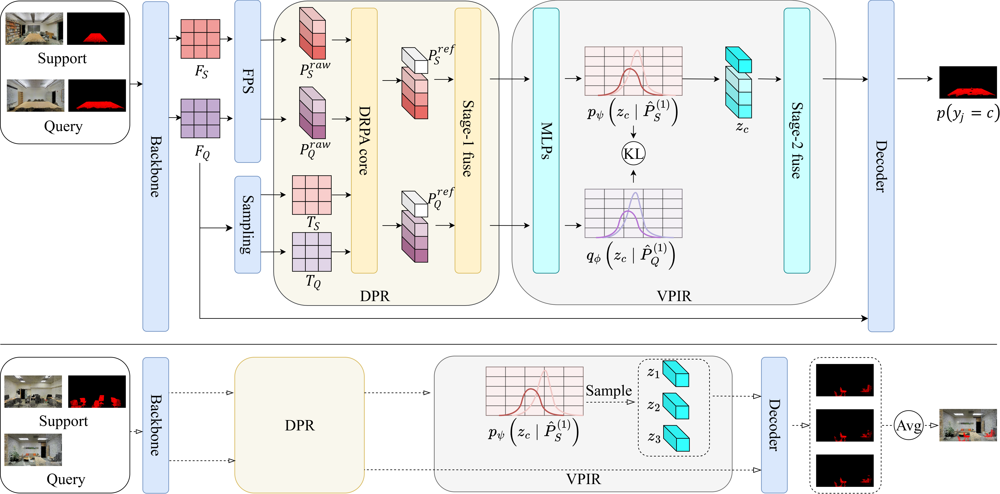
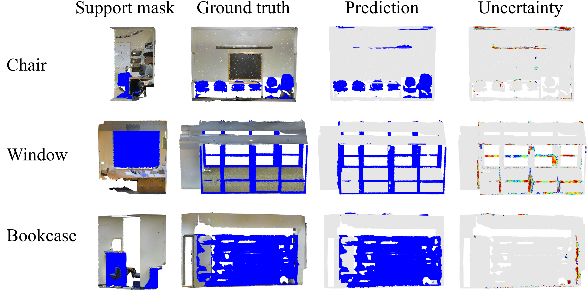

# Uncertainty-aware Prototype Learning with Variational Inference for Few-shot Point Cloud Segmentation

*Yifei Zhao, Fanyu Zhao, Yinsheng Li*

[](https://arxiv.org/)
[](https://www.python.org/downloads/)
[](https://pytorch.org/)

Welcome to the official PyTorch implementation repository of our paper **Uncertainty-aware Prototype Learning with Variational Inference for Few-shot Point Cloud Segmentation**, currently under review. This repository contains the official implementation of **UPL** (Uncertainty-aware Prototype Learning), a probabilistic framework for few-shot 3D point cloud segmentation that enables uncertainty-aware prototype learning through variational inference.

> **⚠️ Note**: This code is currently under debugging and refinement. The complete and stable version will be updated soon. Please refer to the paper for detailed methodology.

## 📖 Abstract

Few-shot 3D semantic segmentation aims to generate accurate semantic masks for query point clouds with only a few annotated support examples. Existing prototype-based methods typically construct compact and deterministic prototypes from the support set to guide query segmentation. However, such rigid representations are unable to capture the intrinsic uncertainty introduced by scarce supervision, which often results in degraded robustness and limited generalization.

In this work, we propose **UPL** (Uncertainty-aware Prototype Learning), a probabilistic approach designed to incorporate uncertainty modeling into prototype learning for few-shot 3D segmentation. Our framework introduces two key components. First, UPL introduces a dual-stream prototype refinement module that enriches prototype representations by jointly leveraging limited information from both support and query samples. Second, we formulate prototype learning as a variational inference problem, regarding class prototypes as latent variables. This probabilistic formulation enables explicit uncertainty modeling, providing robust and interpretable mask predictions.

Extensive experiments on the widely used ScanNet and S3DIS benchmarks show that our UPL achieves consistent state-of-the-art performance under different settings while providing reliable uncertainty estimation.

## 🎯 Key Features

- **Dual-stream Prototype Refinement (DPR)**: Enhances prototype discriminability by leveraging mutual information between support and query sets
- **Variational Prototype Inference Regularization (VPIR)**: Models class prototypes as latent variables to capture uncertainty and enable probabilistic inference
- **Uncertainty Estimation**: Provides reliable uncertainty maps alongside segmentation predictions
- **State-of-the-art Performance**: Achieves consistent improvements on S3DIS and ScanNet benchmarks

## 🏗️ Framework Overview



Our UPL framework consists of two primary modules:
1. **Dual-stream Prototype Refinement (DPR)**: Refines prototypes by leveraging mutual information between support and query features
2. **Variational Prototype Inference Regularization (VPIR)**: Models prototypes as Gaussian latent variables for uncertainty-aware learning

## 📊 Results

### Main Results on S3DIS and ScanNet

| Dataset | Method | 1-way 1-shot | 1-way 5-shot | 2-way 1-shot | 2-way 5-shot |
|---------|--------|--------------|--------------|--------------|--------------|
| | | **S0** | **S1** | **Mean** | **S0** | **S1** | **Mean** | **S0** | **S1** | **Mean** | **S0** | **S1** | **Mean** |
| **S3DIS** | AttMPTI | 36.32 | 38.36 | 37.34 | 46.71 | 42.70 | 44.71 | 31.09 | 29.62 | 30.36 | 39.53 | 32.62 | 36.08 |
| | QGE | 41.69 | 39.09 | 40.39 | 50.59 | 46.41 | 48.50 | 33.45 | 30.95 | 32.20 | 40.53 | 36.13 | 38.33 |
| | QPGA | 35.50 | 35.83 | 35.67 | 38.07 | 39.70 | 38.89 | 25.52 | 26.26 | 25.89 | 30.22 | 32.41 | 31.32 |
| | CoSeg | 46.31 | 48.10 | 47.21 | 51.40 | 48.68 | 50.04 | 37.44 | 36.45 | 36.95 | 42.27 | 38.45 | 40.36 |
| | **UPL (Ours)** | **48.18** | **49.02** | **48.60** | **55.92** | 48.53 | **52.22** | **38.13** | **37.44** | **37.79** | 41.78 | **41.96** | **41.87** |
| **ScanNet** | AttMPTI | 34.03 | 30.97 | 32.50 | 39.09 | 37.15 | 38.12 | 25.99 | 23.88 | 24.94 | 30.41 | 27.35 | 28.88 |
| | QGE | 37.38 | 33.02 | 35.20 | 45.08 | 41.89 | 43.49 | 26.85 | 25.17 | 26.01 | 28.35 | 31.49 | 29.92 |
| | QPGA | 34.57 | 33.37 | 33.97 | 41.22 | 38.65 | 39.94 | 21.86 | 21.47 | 21.67 | 30.67 | 27.69 | 29.18 |
| | CoSeg | 41.73 | 41.82 | 41.78 | 48.31 | 44.11 | 46.21 | 28.72 | 28.83 | 28.78 | 35.97 | 33.39 | 34.68 |
| | **UPL (Ours)** | **43.13** | **42.87** | **43.00** | **48.48** | **45.18** | **46.83** | **32.09** | **32.68** | **32.39** | **39.65** | **37.15** | **38.40** |

### Qualitative Results



UPL produces cleaner object boundaries and provides uncertainty maps that highlight regions of occlusion and label ambiguity.

### Uncertainty Analysis


Our framework provides interpretable uncertainty estimates that correlate with prediction errors, enabling better model interpretability.

## 🚀 Installation

> **⚠️ Warning**: The code is currently under active development and debugging. Some features may not work as expected. Please use with caution.

### Prerequisites

- Python 3.8+
- PyTorch 1.8+
- CUDA 10.2+

### Setup

1. Clone the repository:
```bash
git clone https://github.com/your-username/UPL.git  # TODO: Replace with actual repository URL
cd UPL
```

2. Install dependencies:
```bash
pip install -r requirements.txt  # TODO: Create requirements.txt file
```

3. Install PyTorch Points3D:
```bash
pip install torch-points3d
```

## 📁 Dataset Preparation

### S3DIS
1. Download the S3DIS dataset from [here](http://buildingparser.stanford.edu/dataset.html)
2. Preprocess the data following the instructions in the original CoSeg repository  # TODO: Add specific preprocessing steps
3. Place the processed data in `data/s3dis/`  # TODO: Create data directory structure

### ScanNet
1. Download the ScanNet dataset from [here](http://www.scan-net.org/)
2. Preprocess the data following the instructions in the original CoSeg repository  # TODO: Add specific preprocessing steps
3. Place the processed data in `data/scannet/`  # TODO: Create data directory structure

## 🏃‍♂️ Training

> **⚠️ Note**: Training scripts are currently being debugged. The complete training pipeline will be available in the next update.

### Basic Training Command

```bash
python main_fs.py \
    --config config/s3dis_UPL_fs_train.yaml \
    --save_path my_weights/ablation/upl_s30_1w1s \
    --pretrain_backbone weights/s3_s0pre/ \
    --n_subprototypes 20 \
    --cvfold 0 \
    --n_way 1 \
    --k_shot 1 \
    --num_episode_per_comb 1000 \
    --base_proto_ema 0.999 \
    --fixed_num_points 2048 \
    --var_infer_hidden_dim 128 \
    --pa_type dpr \
    --Few-shot.use_vpir 1 \
    --vis 1
```

### Key Parameters

- `--pa_type`: Choose between `dpr` (Dual-stream Prototype Refinement) or `spr` (Single-stream Prototype Refinement)
- `--Few-shot.use_vpir`: Enable/disable Variational Prototype Inference Regularization (1/0)
- `--vis`: Enable/disable visualization (1/0)
- `--n_way`: Number of novel classes (1 or 2)
- `--k_shot`: Number of support examples per class (1 or 5)

### Training on Different Datasets

For S3DIS:
```bash
python main_fs.py --config config/s3dis_UPL_fs_train.yaml [other parameters]
```

For ScanNet:
```bash
python main_fs.py --config config/scannetv2_UPL_fs_train.yaml [other parameters]
```

## 🔍 Evaluation

### Evaluation Command

    ```bash
python main_fs.py \
    --config config/s3dis_UPL_fs.yaml \
    --save_path my_weights/ablation/upl_s30_1w1s \
    --pretrain_backbone weights/s3_s0pre/ \
    --n_subprototypes 20 \
    --cvfold 0 \
    --n_way 1 \
    --k_shot 1 \
    --num_episode_per_comb 1000 \
    --base_proto_ema 0.999 \
    --fixed_num_points 2048 \
    --var_infer_hidden_dim 128 \
    --pa_type dpr \
    --Few-shot.use_vpir 1 \
    --vis 1
```

## 📈 Ablation Studies

### Effect of DPR and VPIR Modules

| DPR | VPIR | 2-way 1-shot | 2-way 5-shot |
|-----|------|--------------|--------------|
| ✗ | ✗ | 27.32 | 33.65 |
| ✗ | ✓ | 30.19 | 36.04 |
| ✓ | ✓ | **32.39** | **38.40** |

### Effect of Prior Sampling

| T | 1-way 1-shot | 1-way 5-shot |
|---|--------------|--------------|
| 3 | 48.60 | 52.22 |
| 4 | 50.32 | 53.18 |
| 5 | 51.69 | 53.06 |

## 🎨 Visualization

The framework provides comprehensive visualization capabilities:

- **Segmentation Results**: Visual comparison of predictions with ground truth
- **Uncertainty Maps**: Heatmaps showing prediction uncertainty
- **Prototype Visualization**: 3D visualization of learned prototypes

Visualization results are saved in the `vis_results/` directory when `--vis 1` is enabled.

## 📚 Citation

If you find this work useful, please cite our paper:

```bibtex
@article{zhao2024upl,  # TODO: Update with actual paper details when published
  title={Uncertainty-aware Prototype Learning with Variational Inference for Few-shot Point Cloud Segmentation},
  author={Zhao, Yifei and Zhao, Fanyu and Li, Yinsheng},
  journal={arXiv preprint arXiv:XXXX.XXXXX},  # TODO: Update with actual arXiv ID
  year={2024}  # TODO: Update with actual publication year
}
```

## 🙏 Acknowledgments

This work is built upon the [CoSeg](https://github.com/Na-Z/CoSeg) repository. We thank the authors for their excellent work and codebase.

## 📄 License

This project is licensed under the MIT License - see the [LICENSE](LICENSE) file for details.  # TODO: Create LICENSE file

## 📞 Contact

For questions and issues, please contact:
- Yifei Zhao: yfzhao19@fudan.edu.cn
- Fanyu Zhao: fyzhao20@fudan.edu.cn